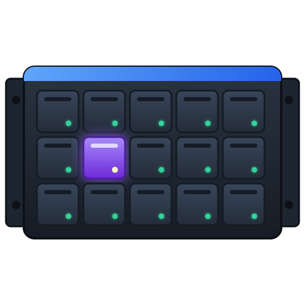
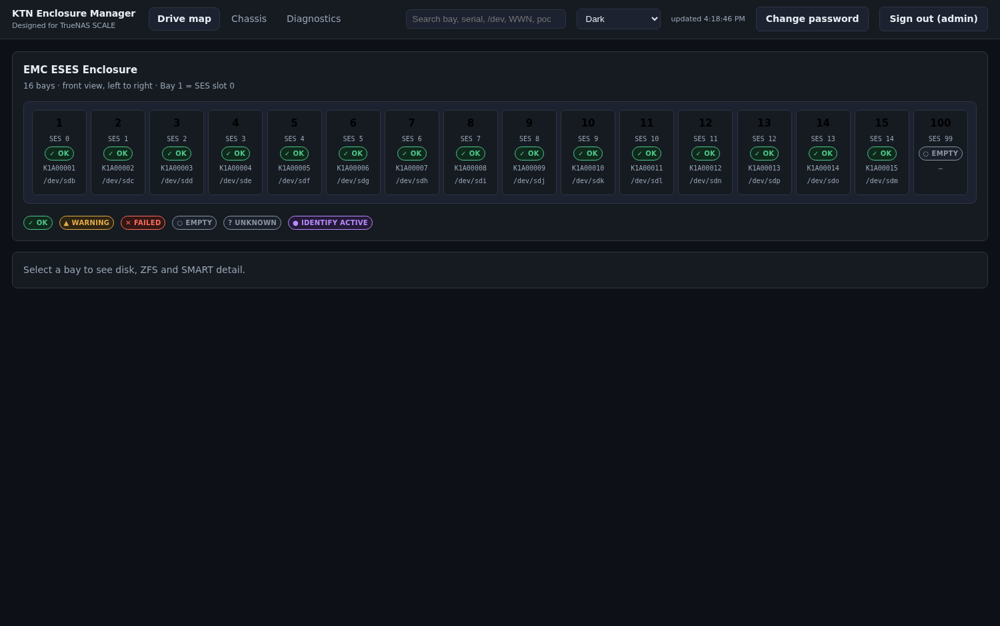
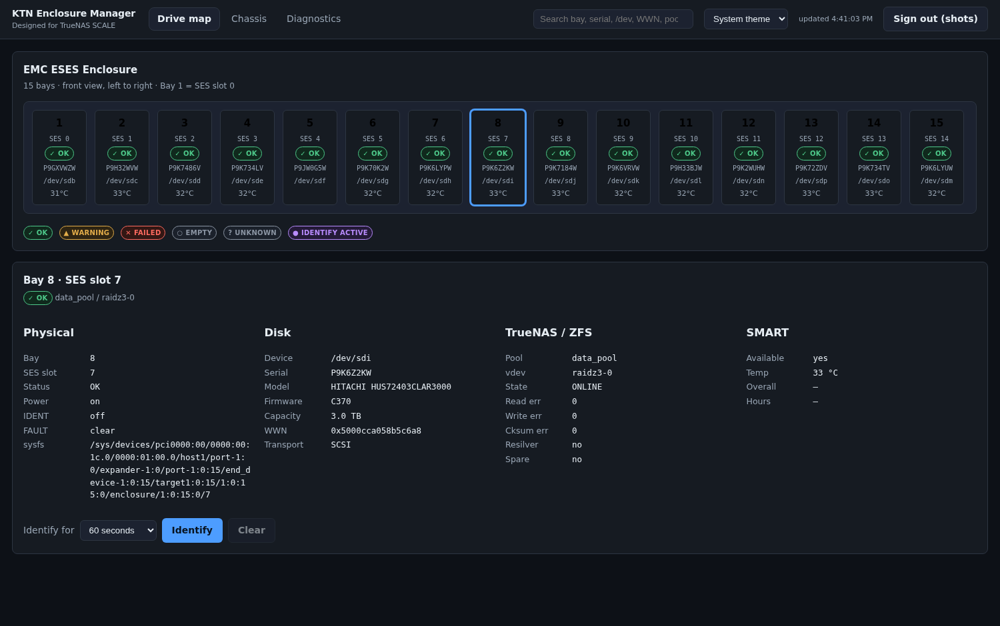
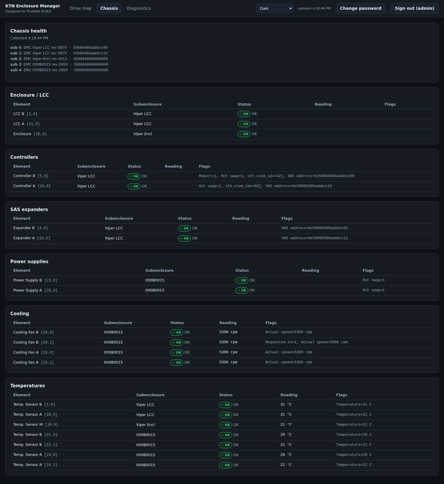

#  KTN Enclosure Manager

A local, zero-cost, web-based enclosure manager for SAS disk shelves attached to
**TrueNAS SCALE Community Edition** — validated end to end against an
**EMC KTN-STL3**.

TrueNAS gates its built-in enclosure UI behind iX hardware
(`truenas.is_ix_hardware → False`, `enclosure2.query → []`), so *View Enclosure*
shows "Enclosure Unavailable" on a community system with a third-party shelf.
This application fills that gap **without** patching middleware, spoofing
hardware identity, or touching the TrueNAS WebUI.



---

## What it does

- **Physical drive map** — one horizontal row matching the real shelf, Bay 1 on
  the left. Bay numbers are 1-based for humans; the SES slot is always shown too.
- **Per-bay detail** — serial, WWN, model, firmware, capacity, current `/dev/sdX`,
  pool, vdev, ZFS state and error counters, SMART temperature.
- **Chassis telemetry** — LCC A/B, both controllers, both SAS expanders, both
  PSUs with their fail/AC/DC flags, cooling fans with RPM, every temperature
  sensor.
- **Identify** — light a bay's LED for 10s, 30s, 60s, 5 minutes, or until
  cleared. Timers are server-side, so closing the browser cannot strand a lit LED.

  
- **Alerts** — posts to ntfy or any webhook when a bay's health changes, naming
  the bay, serial and pool so you know which drive to pull. Transitions only, so
  a degraded pool does not message every poll.
- **Diagnostics and audit** — sanitised, copyable diagnostics; every write logged.

| | |
|---|---|
|  |  |

## Requirements

- TrueNAS SCALE (developed and validated on **25.10.5**, kernel 6.12.95)
- A SAS HBA in IT/HBA mode with an SES enclosure attached, visible as
  `/sys/class/enclosure/*`
- Docker (present on TrueNAS SCALE) or the TrueNAS *Custom App* UI
- Optional: a TrueNAS API key, for pool/vdev/ZFS/SMART data

Nothing is installed on the host. `sg3-utils` ships inside the image.

## Install

**On TrueNAS SCALE — no shell required.** Apps → Discover Apps → **⋮** →
**Install via YAML**, paste [`truenas/install-via-yaml.yaml`](truenas/install-via-yaml.yaml),
edit the four `### EDIT ###` lines, install. Full walkthrough:
**[docs/INSTALL-TRUENAS.md](docs/INSTALL-TRUENAS.md)**.

A prebuilt image is published for every release, so there is nothing to build:

```
ghcr.io/mechanicalcoderx/ktn-enclosure-manager:latest
```

**From a shell instead:**

```bash
git clone https://github.com/MechanicalCoderX/ktn-enclosure-manager.git
cd ktn-enclosure-manager
cp .env.example .env && chmod 600 .env
$EDITOR .env                     # set KTN_TRUENAS_URL / API key / KTN_SG_DEVICE

mkdir -p data && chown -R 1000:1000 data     # required: the app runs as uid 1000

docker compose up -d
```

Then open `http://<truenas>:8420` and **create the administrator account** — the
first run has no account and no default password. The account dialog (top
right) can change the password or **sign the account out everywhere** — both
end every existing session, so a suspected stolen cookie has a remedy that
does not force a credential rotation.

Prefer an open dashboard with no login, the way scrutiny and most TrueNAS
monitoring apps work? Set `KTN_AUTH_REQUIRED=false`. The Identify LED write
stays refused without an account even then — see
[SECURITY.md](SECURITY.md#running-it-open-and-why-the-led-write-is-gated-separately).

Find your SES device and enclosure id:

```bash
lsscsi -g | grep enclosu          # -> /dev/sgN
cat /sys/class/enclosure/*/id     # -> 0x...  (put in KTN_ENCLOSURE_ALLOWLIST)
```

### Privileges

The container is **not** privileged, mounts no host path other than its own data
directory, runs under the default AppArmor profile, and drops every capability
except `SETUID`/`SETGID` (used once, to drop the web process to uid 1000). Its
only hardware access is the SES device node.

The Identify LED is driven by a SCSI command rather than a sysfs write, which is
what makes that possible — see [SECURITY.md](SECURITY.md).

### TrueNAS Custom App

Apps → Discover Apps → Custom App, or install via the compose file above from a
shell. Use a dataset path for `KTN_DATA_PATH` so accounts and the audit log
survive redeployment, and remember `chown -R 1000:1000` on it.

## Configuration

Everything is environment driven; see [`.env.example`](.env.example) for the
annotated list. The essentials:

| Variable | Meaning |
|---|---|
| `KTN_TRUENAS_URL` / `KTN_TRUENAS_API_KEY` | pool, vdev, ZFS error and SMART data. Leave empty to run without. Use a least-privilege key — see [SECURITY.md](SECURITY.md#the-truenas-api-key-use-a-least-privilege-one) |
| `KTN_TRUENAS_VERIFY_TLS` | defaults to `true`. If it fails, connect by the name on the certificate rather than by IP — see [SECURITY.md](SECURITY.md#tls-connect-by-the-name-on-the-certificate) |
| `KTN_TRUENAS_REST_FALLBACK` | defaults to `false`. Legacy REST fallback for the JSON-RPC transport; only useful with a full-access key, and REST is removed in TrueNAS 26.04 — see `.env.example` |
| `KTN_SG_DEVICE` | SES device node to expose to the container |
| `KTN_ENCLOSURE_ALLOWLIST` | restrict management to specific enclosure ids |
| `KTN_POLL_*_SECONDS` | polling intervals (5 / 20 / 30 / 120 by default) |
| `KTN_ALERT_WEBHOOK_URL` | ntfy topic or webhook for health-change alerts; empty disables |
| `KTN_ALERT_STYLE` | `ntfy` (plain text + headers) or `json` |
| `KTN_AUTH_REQUIRED` | defaults to `true`. `false` runs it as an open read-only dashboard, like scrutiny |
| `KTN_ALLOW_ANONYMOUS_IDENT` | defaults to `false`, and stays false when auth is off. Permits the LED write with no account |

One backend poll serves every connected browser; expensive `sg_ses` and SMART
reads are cached and never run per client.

## How it identifies hardware

`/dev/sdX` is **never** identity. A bay is keyed by *(enclosure logical id, SES
slot)*, and the disk in it by serial + WWN. Device names are runtime detail and
are expected to change.

Slot-to-disk mapping comes from `<enclosure>/<slot>/device/block` in sysfs. Two
findings from this hardware are worth knowing, because a plausible
implementation gets both wrong:

- The mapping is **not** alphabetical. On this shelf slots 11–14 are
  `sdn, sdp, sdo, sdm`. Sorting device names produces a wrong map that looks
  right for the first eleven bays.
- SES reports a drive's SAS **port** address while the block layer reports its
  **node** WWN, and they differ by 2. Correlating the two by equality silently
  matches nothing.

### Fan control is not available on this shelf

The shelf exposes four cooling elements — `Cooling Fan B` at type header `20`
(elements `20,0`, `20,1`) and `Cooling Fan A` at `23` (`23,0`, `23,1`) — plus
an aggregate `Cooling Fan M` at `17` with zero elements, which must not be
written to. SES-3 defines a REQUESTED SPEED CODE field for these, so the
question is not whether the field exists but whether the LCC honours it.

**Fan policy belongs to the firmware, and that is directly observable
read-only.** The captured fixtures in `tests/fixtures/ktn-stl3/` (2026-08-13)
show every cooling element at `Actual speed=5300 rpm, Fan at highest speed`.
On 2026-08-27 the same shelf reports bank B still at 5300 RPM (`speed_code=7`)
and bank A at **2490 RPM (`speed_code=3`)** — while both PSU sensors read the
same temperatures. No host has ever written to subenclosure 4, so bank A
changed speed entirely on the enclosure's own authority. Two dated captures,
no writes, different speeds: the firmware modulates, and it does so per bank.

**Nothing here demonstrates that a well-formed speed request is refused,
because one has never been sent.** The single write attempted in this
project's history was `sg_ses --index=20,0 --set=speed_code=6`, and that
command is self-contradictory: `sg_ses` builds the control element by copying
the status element's flags, element `20,0` reports `Requested on=0`, and
SES-3 Table 86 defines `RQST ON = 0` as *"the cooling mechanism is requested
to turn off or remain off"*. So the enclosure was asked to set a speed **and**
to switch the fan off, in the same descriptor. Reports on other hardware
(Supermicro SC847E, Xyratex HB-1235) show that exact command form briefly
stopping a fan before firmware reverts it. Treat "the firmware ignores speed
requests" as **unproven**; what is proven is that no host-reachable override
has ever been demonstrated on this hardware family, and that the firmware is
actively managing the fans regardless.

**`rc=0` is not confirmation**, and here it structurally cannot be: the
Cooling *status* element carries `ACTUAL FAN SPEED` but no requested-speed
read-back at all, so there is no field in which an accepted request could be
observed. Anything checking only the exit status would report a working fan
controller while nothing changed. Read the actual speed back, twice, seconds
apart.

**There is no non-SES path, and that one is permanent.** The Linux `ses`
driver enumerates only `ENCLOSURE_COMPONENT_DEVICE` and
`ENCLOSURE_COMPONENT_ARRAY_DEVICE` (`drivers/scsi/ses.c`), so cooling
elements never appear under `/sys/class/enclosure/` on any kernel, for any
enclosure — the drive `locate` and `active` attributes are there, no fan node
is. This shelf also returns Illegal Request for mode page `0x14` (Enclosure
Services Management), so that avenue is closed too.

Two related facts from the same investigation:

- The enclosure publishes **no thermal thresholds at all** — every temperature
  sensor reports `high critical=<reserved>` and `high warning=<reserved>` on
  the Threshold In/Out page. It will never warn that it is too hot. Any
  thermal safety has to be built from drive SMART temperatures.
- EMC's real fan mechanism, if it is reachable at all, is behind vendor-specific
  pages (`0x10`, `0x11`, `0x80`, `0x82`, `0x83`, `0x91`, `0xf0`, `0xf1`).
  Undocumented writes to an LCC carrying live drives are a different risk class
  from a spec-defined field the firmware ignores, and this project does not go
  there. **The only write this application performs remains the IDENT LED.**

## Health states

Health is never conveyed by colour alone: every state carries a glyph, a text
label, and an accessible name.

`✓ OK` · `▲ Warning` · `✕ Failed` · `○ Empty` · `? Unknown` · `● Identify active`

An IDENT that this application did not start is shown as
**external/unknown origin** and is never cleared automatically.

## Troubleshooting

**No enclosure detected.** Confirm `/sys/class/enclosure` is non-empty on the
host and that the HBA is passed through to the TrueNAS VM. Check
`docker logs ktn-enclosure-manager` for the startup line listing discovered
enclosures.

**Chassis section says unavailable.** The container needs the SES device node
granted at least `:r` (telemetry runs on a read-only open; see SECURITY.md).
Confirm with `docker exec ktn-enclosure-manager sg_ses --readonly -p cf /dev/sgN`.

**Identify returns a permission error.** Check the SES device is granted `:rw`
— the LED write is the one operation that needs the `w`; a `:r` grant is a
valid monitoring-only deployment where exactly this error is expected
(see above). If your enclosure does not support the SES identify command, set
`KTN_IDENT_METHOD=sysfs` — but note that path needs a writable `/sys` and
`apparmor=unconfined`.

**Pool/vdev/SMART columns empty.** TrueNAS is unreachable or the API key is
wrong. The banner names the error, and the drive map keeps working — bay state
is read directly from the enclosure.

**`log_info(0x31120434) ... code(0x12)` in the kernel log.** That is
`PL_LOGINFO_CODE_ABORT`. sg_ses issues a `REPORT TIMESTAMP` command on every
run; shelves that don't support it return `DID_SOFT_ERROR` and the HBA logs an
abort — one per invocation, which at a 30-second poll is thousands a day.
Nothing breaks, but it saturates the kernel ring buffer with noise and hides
real `mpt3sas` history. Fixed in **1.2.2**, which passes `--no-time`; upgrade
if you see it. To confirm the cause on your own shelf:

```bash
sg_ses --join /dev/sgN 2>&1 >/dev/null    # prints the DID_SOFT_ERROR line
sg_ses --no-time --join /dev/sgN 2>&1 >/dev/null   # silent
```

**Everything logs out on restart.** `/data` is not writable by uid 1000. The
container refuses to start in this state and prints the fix.

## Upgrades, backup, uninstall

```bash
# upgrade
git pull && docker compose build && docker compose up -d

# backup - accounts, session key, IDENT timers, audit log
tar czf ktn-backup.tgz data/

# uninstall (removes the app; touches nothing on the host)
docker compose down --rmi all
```

State lives entirely in `/data`. The application creates no host files, no
systemd units, and no TrueNAS configuration.

## Development

```bash
python3 -m venv .venv && .venv/bin/pip install -e 'backend[dev]'
PYTHONPATH=backend .venv/bin/python -m pytest tests/ -q      # no hardware needed

cd frontend && npm install && npm run build
npx playwright test                                          # E2E against the real backend
```

<!-- The test count deliberately is not quoted here. It was stated as an exact
     number three times and was wrong by the next commit each time. -->

### Regenerating the screenshots

```bash
KTN_E2E_SYNTHETIC_SLOTS=0 bash scripts/e2e-server.sh &   # backend on :8421
node frontend/scripts/screenshots.mjs        # the PNGs
node frontend/scripts/identify-demo.mjs      # the demo GIF (see its header for the ffmpeg step)
```

`KTN_E2E_SYNTHETIC_SLOTS=0` prunes the fixture's synthetic empty bay (SES 99,
a discovery test aid) so the images show the shelf's real 15 bays.

Shot against the captured fixture, never a live shelf. The fixture is already
sanitised — serials `K1A0000N`, pool `tank` — so the images cannot carry real
drive identifiers into a public repository. `tests/fixtures/fake-sg_ses`
replays the captured SES pages, which is what lets the chassis view render
with no enclosure attached.

The whole suite runs against captured KTN-STL3 fixtures in
`tests/fixtures/`, so it needs no shelf attached. Regenerate the synthetic sysfs
tree with `python3 tests/build_sysfs_fixture.py`.

## Compatibility

Validated on an EMC KTN-STL3 (15 bays, dual Viper LCC, dual PSU). The discovery,
mapping and IDENT layers are generic Linux enclosure sysfs code with no
KTN-specific logic, so other SES shelves are likely to work; the chassis parser
reads element labels from the device itself rather than assuming this shelf's
layout. Multiple enclosures are supported by the backend and selectable in the UI.

## Acknowledgements

Concepts were validated against, and this project was informed by, these
MIT-licensed projects — no code was copied:
[truenas-disk-map](https://github.com/Alex-Goaga/truenas-disk-map),
[ses-led-control](https://github.com/nmuellerdo/ses-led-control),
[freenas-drive-locator](https://github.com/abdlmalekluttee/freenas-drive-locator).

The slot-mapping and IDENT behaviour of TrueNAS'
`middlewared.plugins.enclosure_.sysfs_disks` was used as *reference behaviour*
only; this is an independent implementation against the Linux sysfs ABI, with no
runtime dependency on TrueNAS internals.

## Licence and trademarks

[MIT](LICENSE).

Not affiliated with, endorsed by, or sponsored by iXsystems or Dell EMC.
"TrueNAS" is a trademark of iXsystems, Inc.; "EMC" of Dell Inc. Used here only
to describe compatibility. This is not an official TrueNAS feature.
